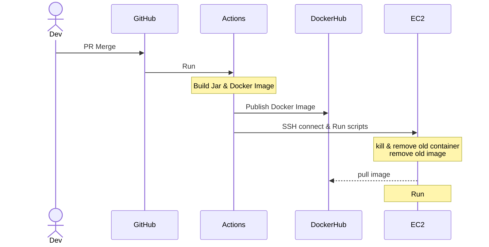

# Geo Coding API for Spring Boot

## Set up Repository secrets for CI/CD
- Spring Boot (***These are the necessary environment variables for running standalone without CI/CD.***)
  - MONGO_HOST (application.yml)
  - MONGO_PORT (application.yml)
  - MONGO_DATABASE (application.yml)
  - MONGO_USERNAME (application.yml)
  - MONGO_PASSWORD (application.yml)
  - SENTRY_ORG (build.gradle)
  - SENTRY_PROJECT_NAME (build.gradle)
  - SENTRY_AUTH_TOKEN (build.gradle)
  - SENTRY_DNS (application.yml)
- Docker Hub
  - DOCKER_USERNAME
  - DOCKER_REPOSITORY
  - DOCKER_PASSWORD
- AWS EC2 (***In the development phase, we are deploying directly to EC2, but plan to change this approach in the future***)
  - EC2_HOST
  - EC2_KEY
  - EC2_USERNAME

## CI/CD Flow



## How To Set Database

- Prerequisites:
  - Node
  - Yarn
  - Docker

- Clone `philippines-json-maps` repository
    ```sh
    git clone https://github.com/GeocodingPh/philippines-json-maps.git
    ```

- Run mongodb docker container
    ```sh
    docker-compose up -d
    ```

- Get ts package dependencies
    ```sh
    yarn install
    ```

- Combine geo json files
    ```sh
    yarn go combineJson
    ```

- Insert data into mongodb on docker
    ```sh
    yarn go insert <Resolution>
    ```
  - support resolution
    - hires (simplify 10%)
    - medres (simplify 1%)
    - lowres (simplify 0.1%)
  

